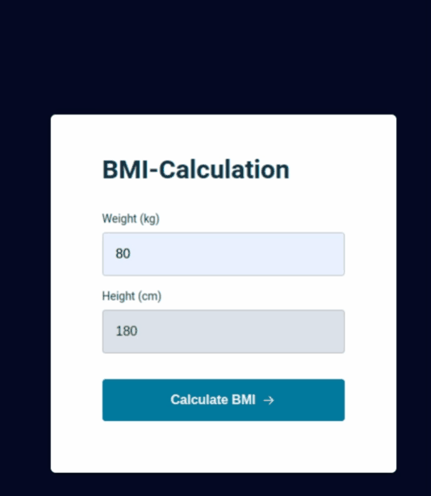

<h1 align="center">BMI Calculator</h1>

  <a href="#-tecnologies">Tecnologies</a>&nbsp;&nbsp;&nbsp;|&nbsp;&nbsp;&nbsp;
  <a href="#-project">Project</a>&nbsp;&nbsp;&nbsp;

<!--  -->

you can see the project [here](https://lisandroguerra.github.io/explorer_bmi/)

## 🚀 Tecnologies

EThis project uses this tecnologies:

- HTML
- CSS
- JavaScript
- Git
- Github

## 💻 Project

This is a simple BMI calculator. It gets the data entry from user in the form fields make the processing and show the results on a modal.
